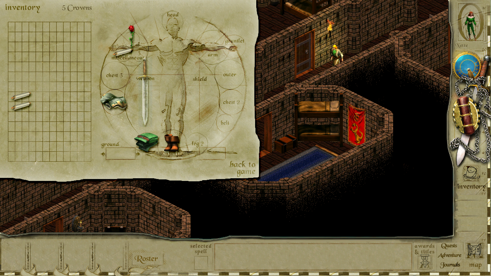

# Siege of Avalon : Open Source #

_"Siege of Avalon : Open Source is an attempt to keep this great isometric RPG game alive by continuing development on it."_

Siege of Avalon in HD with room for party of 4.

## Latest feature added!! ##
Startup launch dialog enable choice of Original/HD/FullHD resolutions and language - if any available - also on old retail releases.

Tested with "Siege of Avalon Anthology - Chapters 1-6" build 1.1.2001.1104 from 2001 - just copy Siege.exe and DDraw.dll found under releases - and the game can be played in higher resolutions.

Also now testing German chapters 1-6 with the SoAmigos Patch v0.7 applied. Since that patch does contain missing translations among other things. Was only relevant for German version.

## How to complie ##
Install Delphi 10.3.3 or newer - the free Community Edition found at https://www.embarcadero.com/products/delphi/starter will do fine.  
Open the Siege.dpr project file and compile.

## Installing ##

Copy or download Siege.exe together with ddraw.dll from the latest releases - and copy into the games install folder.

To play the game your need additional files in the game/install folder:
- soundlib.dll
- fmod.dll
- DFX_P5S.DLL
- DFX_P6S.DLL

all found in the original free playable 1. chapter/demo - http://soaos.sourceforge.net/FreePage.htm

The newest ddraw.dll from [**DDrawCompat**](https://github.com/narzoul/DDrawCompat) - binary can be downloaded under his repos releases.

## Playing ##

You launch the game by running Siege.exe that is build into the game folder.

## New Settings added ##

Unlike the original game, it is now possible - based on the work of Rucksacksepp from the SOAmigos forum - in the Options dialog to select either Original, HD or FullHD screen resolutions. The game runs only full screen.  
Also added are improvements in how hit point are distributed to the party of companions and their AI behaviour - these are found in the siege.ini file:

- AdjustedPartyHitPoints (defaults to false)
- AdjustedCompanionAI (defaults to true)

As mentioned there is also:

- ScreenResolution (defaults to 600) - possible other values are 720 and 1080

There is also a language path that was not surfaced in the Options dialog of the released code - but assets where available in the release - english, spanish and german are available currently. The released assets are now found under releases - and has been removed from the repo since they do not a such belong to the engine and makes testing various game releases cumbersome.

- LanguagePath (defaults to english) 

## Focus and origin ##

This is a fork from the [**gondur/Siege-of-Avalon-Open-Source**](https://github.com/gondur/Siege-of-Avalon-Open-Source) repository, which again is a fork of the original released repository moved over from Sourceforge where it was released in 2003.

The main focus of this fork: 

1. Moving the Win32 Delphi 4 source code to Delphi 10.3 or later - including its free Community Editons. **DONE** (and keep it updated to the latest Delphi release)
2. Fixing various glitches. **DONE** (until proved wrong)
3. Heavy refactoring, to make the code a joy to work with - and benefit a modern Object Pascal dialect. **ONGOING**
4. Include HD/FullHD support like already done by gondur. **DONE** (someone should improve the interface graphics I did)
5. Possibly replace DX with SDL2/other to gain crossplatform support, but since the DirectX headers are maintained for latest Delphi versions - this has lower priority.
6. Added improvements and fixes found by the community. **ONGOING**
7. Support Ashes of Avalon (AoA) and other Mods out of the box.

Also check out the gondur fork for changes, and the thread on SOAmigos (in german), where Raptor/Rucksacksepp (http://soamigos.de/wbb5/forum/index.php?thread/4458-hd-und-fullhd-version-zu-siege-of-avalon-aus-dem-source-code-mit-delphi-4/&postID=91286#post91286) originally fixed building with Delphi 4 amoung other things.

Look in the CHANGELOG for status, changes and planned changes.

Tooling and documentation might be found here but would probably be tied to their seperate tooling repositories:

[**POX Studio**](https://github.com/SteveNew/POXStudio) - POX file editor and fileformat documentation.
